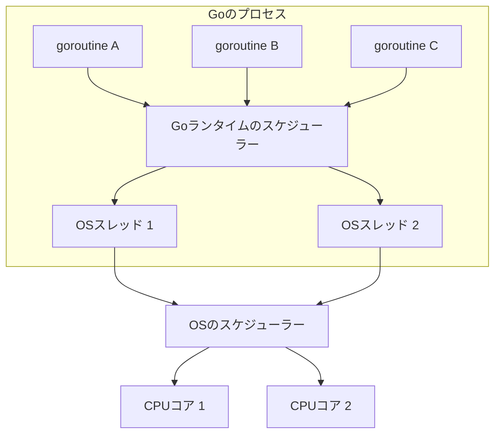

Goは文法がシンプルで、比較的学びやすい言語だと聞いていました。

実際に勉強を始めてみると、変数、`if`、`for`、`struct`あたりまでは理解できました。ほかの言語との違いを確認しながら、順番に読み進められました。

少し実践的なコードを読むようになると、「読めるけれど、なぜ動くのか説明できない」と感じる場面が増えました。今回は、そこで生まれた次の疑問を整理します。

- goroutineは、プロセスやOSスレッドとどういう関係なのか
- Rubyのダックタイピングと、Goのinterfaceは何が違うのか
- 関数内の変数は、スタックとヒープのどちらに置かれるのか
- いろいろな関数に渡されている`context.Context`は何なのか

網羅的な解説というより、現時点での学習記録です。

## goroutineってなに

goroutineを学んだとき、最初に気になったのは使い方ではありませんでした。「これはコンピューターのどの階層に存在するものなのか」がよくわかりませんでした。

```go
go fetchData()
```

このコードを見て、最初は次のような親子関係を想像しました。

```text
プロセス
└── OSスレッド
    └── goroutine
```

しかし、この理解では疑問が残ります。1つのgoroutineは、ずっと同じOSスレッド上で動くのでしょうか。goroutineを1万個作ると、OSスレッドも1万個できるのでしょうか。

調べてみると、goroutineはOSが直接管理する実行単位ではなく、**Goランタイムが管理する実行単位**でした。

単純な親子関係として考えるよりも、スケジューラーが二段あると捉えると理解しやすくなりました。



大まかには、次の二段階です。

1. Goランタイムが、実行可能なgoroutineをOSスレッドへ割り当てる
2. OSが、OSスレッドをCPUコアへ割り当てる

Go公式の「Effective Go」でも、goroutineは複数のOSスレッド上に多重化されると説明されています。

つまり、goroutineとOSスレッドは1対1ではありません。複数のgoroutineが、複数のOSスレッド上で切り替えられながら動きます。

### OSスレッドとの違い

OSスレッドはOSが認識してスケジューリングします。一方、goroutineを認識してスケジューリングするのはGoランタイムです。

goroutineは小さなスタックから始まり、必要に応じてスタックが伸縮します。そのため、OSスレッドを同じ数だけ作る場合と比べて、小さなコストで多くのgoroutineを作れます。

また、goroutineは通常、特定のOSスレッドに固定されません。実行されるOSスレッドは、Goランタイムのスケジューリングによって変わる可能性があります。

### goroutineを作ることと、並列に動くことは同じではない

```go
go taskA()
go taskB()
```

このコードは、`taskA`と`taskB`が必ず別々のCPUコアで同時に動くことを保証しているわけではありません。

2つの処理を独立して進められる形にするのが**並行性**で、複数の処理が物理的に同時実行されるのが**並列性**です。

goroutineを使うと並行な構造を作れますが、実際に並列実行されるかどうかは、利用できるCPUや実行時の状況などにも左右されます。

ここまで調べて、goroutineは「OSスレッドより下にある小さなスレッド」というより、**OSスレッド上で動くようにGoランタイムが管理しているタスク**と考えるようになりました。

参考：

- [Effective Go - Goroutines](https://go.dev/doc/effective_go#goroutines)
- [Go FAQ - Why goroutines instead of threads?](https://go.dev/doc/faq#goroutines)
- [Go FAQ - Why doesn't my program run faster with more CPUs?](https://go.dev/doc/faq#parallel)

## Rubyのダックタイピングと、Goのinterfaceは何が違うのか

次に引っかかったのがinterfaceです。自分はこれまでRubyを触ってきたため、最初はダックタイピングとの違いが分かりませんでした。

### Rubyでは、メソッドを呼べるかどうかを実行時に確認する

ダックタイピングは、オブジェクトのクラスそのものよりも、「必要なメソッドに応答できるか」を重視する考え方です。

普段書いていたRubyでは、次のように引数の型を指定せずにメソッドを呼び出していました。

```ruby
class Dog
  def speak
    "ワン"
  end
end

class Robot
  def speak
    "こんにちは"
  end
end

def greet(speaker)
  puts speaker.speak
end

greet(Dog.new)
greet(Robot.new)
```

`Dog`と`Robot`に継承関係はありません。それでも、どちらも`speak`メソッドを持っているため、`greet`へ渡せます。

一方、`speak`を持っていないオブジェクトを渡すと、実際にメソッドを呼び出した時点で`NoMethodError`が発生します。

```ruby
class Stone
end

greet(Stone.new) # 実行時にNoMethodError
```

Rubyでは、レシーバーへメッセージを送る形でメソッドを呼び出します。呼び出されたメソッドが見つからず、`method_missing`でも処理できなければ`NoMethodError`になります。

### Goでは、必要なメソッドをinterfaceとして先に定義する

Goでは、同じような処理を次のように書けます。

```go
package main

import "fmt"

type Speaker interface {
	Speak() string
}

type Dog struct{}

func (Dog) Speak() string {
	return "ワン"
}

func greet(s Speaker) {
	fmt.Println(s.Speak())
}

func main() {
	greet(Dog{})
}
```

このコードを読んだとき、`Dog`と`Speaker`を結びつけるコードが見当たらないことに引っかかりました。

Goでは、interfaceが要求するメソッドを型が持っていれば、その型はinterfaceを満たします。この対応関係を明示的に宣言する必要はありません。

この例で`Speaker`が要求するのは、次のメソッドです。

```go
Speak() string
```

`Dog`は同じシグネチャーの`Speak`メソッドを持っています。そのため、コンパイラーは`Dog`が`Speaker`を満たしていると判断し、`greet`へ渡すことを許可します。

`Speak`を持たない型を渡した場合は、Rubyのように実行時まで進むのではなく、コンパイル時にエラーになります。

```go
type Stone struct{}

greet(Stone{}) // コンパイルエラー：StoneはSpeakを持っていない
```

これは継承ではなく、型が持つ**メソッドの集合**によってinterfaceを満たしているかが決まる仕組みです。

RubyとGoは、型の名前や継承関係ではなく、必要なメソッドを持っているかを見る点では似ています。ただし、確認するタイミングが異なります。

|                    | Ruby             | Go                          |
| ------------------ | ---------------- | --------------------------- |
| 必要な振る舞い     | 呼び出すメソッド | interfaceに定義したメソッド |
| 確認するタイミング | 実行時           | コンパイル時                |
| メソッドがない場合 | `NoMethodError`  | コンパイルエラー            |

今は、Goのinterfaceを「Rubyのダックタイピングに似た柔軟さを持ちながら、必要なメソッドをコンパイル時に確認できる仕組み」と捉えています。

参考：

- [Ruby公式ドキュメント - Calling Methods](https://docs.ruby-lang.org/en/3.3/syntax/calling_methods_rdoc.html)
- [Ruby公式ドキュメント - NoMethodError](https://docs.ruby-lang.org/en/master/NoMethodError.html)
- [Go言語仕様 - Interface types](https://go.dev/ref/spec#Interface_types)
- [Go言語仕様 - Method sets](https://go.dev/ref/spec#Method_sets)

## スタックとヒープって、そもそも何なのか

goroutineについて調べていると、「goroutineは小さなスタックから始まる」「変数がヒープへ逃げる」といった説明が出てきました。

しかし当時は、スタックとヒープが何を指しているのか、そもそも理解できていませんでした。

これまで触ってきたRubyやTypeScriptでは、変数を置くメモリ領域を意識してコードを書く機会がほとんどありませんでした。もちろん内部にはメモリ管理がありますが、普段のコーディングではランタイムに任せていました。

Goもガベージコレクションを備えているため、すべてのメモリを手動で管理するわけではありません。それでも、goroutineやパフォーマンスについて調べると、スタックとヒープという言葉が頻繁に出てきます。

### まずは、関数呼び出しに使うスタックとして理解した

関数を呼び出すと、その関数の引数、ローカル変数、呼び出し元へ戻るための情報などを置く領域が必要です。この関数呼び出しごとの領域をスタックフレームと呼び、呼び出した順番に積み重ねて管理します。

```text
mainのスタックフレーム
└── fetchUserのスタックフレーム
    └── parseResponseのスタックフレーム
```

`parseResponse`が終了するとそのフレームが取り除かれ、次に`fetchUser`へ戻ります。

Goではgoroutineごとにスタックがあり、小さなサイズから始まって必要に応じて伸縮します。ここで初めて、「goroutineは小さなスタックから始まる」という説明の意味が分かりました。

### 関数が終わっても必要な値はどうなるのか

次に、次のコードが気になりました。

```go
package main

import "fmt"

func newCounter() *int {
	count := 0
	return &count
}

func main() {
	count := newCounter()
	(*count)++
	fmt.Println(*count)
}
```

`count`は`newCounter`のローカル変数です。しかし、そのアドレスは関数の外へ返されています。

もし関数の終了と同時に`count`が使えなくなれば、返されたポインターは無効になってしまいます。

このように、1つの関数呼び出しの範囲を越えて必要になる値などを置くために、ヒープが使われます。ヒープへ置かれた値は、Goのガベージコレクターによって管理されます。

Goでは、変数が関数の外でも参照される可能性がある場合、コンパイラーがその変数をヒープへ配置できます。この判断に使われるのが**escape analysis（エスケープ解析）**です。

次のコマンドを使うと、コンパイラーによる判断の一部を確認できます。

```bash
go build -gcflags="-m" main.go
```

実際にこのコードを確認すると、`count`がヒープへ移されることを示す`moved to heap: count`という出力が得られます。

重要なのは、プログラマーが「これはスタック」「これはヒープ」と構文だけで直接決めているわけではないことでした。ローカル変数として宣言したか、`new`を使ったかだけで配置先が決まるわけでもありません。

Go公式FAQでも、変数がどこに置かれるかは言語の意味には影響しないと説明されています。変数は参照されている間、存在し続けます。

パフォーマンスを調べる場面では、スタックとヒープのどちらに配置されるかが重要になります。ただ、最初は次のように理解しました。

- スタックは、goroutineごとの関数呼び出しを管理する領域
- ヒープは、1つの関数呼び出しを越えて参照される値などにも使われる領域
- 実際の配置先は、コンパイラーがエスケープ解析などを使って判断する

goroutineの章で出てきたスタックも、ここにつながります。goroutineはそれぞれスタックを持ちますが、そこで使うすべての値がスタックに置かれるとは限りません。

goroutineやクロージャの外まで参照が残る値は、エスケープ解析によってヒープへ移される可能性があります。

参考：

- [Go FAQ - How do I know whether a variable is allocated on the heap or the stack?](https://go.dev/doc/faq#stack_or_heap)
- [A Guide to the Go Garbage Collector](https://go.dev/doc/gc-guide)

## いろいろな関数に渡される`context.Context`は何なのか

実践的なGoのコードを読むと、さまざまな関数の第1引数に`ctx`が登場します。

```go
func FetchUser(ctx context.Context, id string) error
```

とにかくよく登場するので、最初はGoの構文なのか、標準ライブラリの機能なのかも分かりませんでした。標準ライブラリの機能だとしても、`ctx`を渡すことで何が起きるのか分からない状態でした。

まず、この引数を分解すると次のようになります。

```text
ctx              引数につけた変数名
context          標準ライブラリからimportしたパッケージ名
Context          contextパッケージで定義されたinterface
```

`ctx`という名前は構文で決められているわけではなく、慣習的に使われている変数名です。実体は、標準ライブラリの`context`パッケージが提供する`Context` interfaceの値です。

ただし、関数がcontextを受け取っただけで、自動的に何かの処理が始まるわけではありません。受け取った関数がcontextを確認したり、さらに呼び出す関数へ渡したりします。

`context.Context`は、主に次の情報を処理の呼び出し先へ伝えるために使われます。

- 処理をキャンセルするためのシグナル
- タイムアウトや期限
- リクエスト単位で必要な値

特に理解しづらかったのは、contextを渡すだけでgoroutineが自動的に止まるわけではないことでした。

```go
package main

import (
	"context"
	"fmt"
	"time"
)

func worker(ctx context.Context, done chan<- struct{}) {
	defer close(done)

	ticker := time.NewTicker(100 * time.Millisecond)
	defer ticker.Stop()

	for {
		select {
		case <-ctx.Done():
			fmt.Println("workerを終了します:", ctx.Err())
			return
		case <-ticker.C:
			fmt.Println("処理中")
		}
	}
}

func main() {
	ctx, cancel := context.WithTimeout(context.Background(), 250*time.Millisecond)
	defer cancel()

	done := make(chan struct{})
	go worker(ctx, done)

	<-done
}
```

`WithTimeout`で作ったcontextは、期限を迎えると`Done`チャンネルを閉じます。`worker`側は`ctx.Done()`を監視し、キャンセルを受け取ったら自分で処理を終了します。

つまり、contextがgoroutineを外から強制終了するのではありません。処理を終了してほしいことを伝え、受け取った側が協調して終了します。

また、goroutineには「このgoroutineから作られたから、自動的にキャンセルも引き継ぐ」という親子関係はありません。上の`go worker(ctx, done)`のように、contextは引数として明示的に渡します。

一方、`context.WithCancel`や`context.WithTimeout`などで作られたcontextには親子関係があります。親がキャンセルされると、そこから派生した子のcontextにもキャンセルが伝わります。

goroutineの実行関係と、contextのキャンセル関係は別物です。この2つを分けて考えると、なぜ`ctx`を関数へ渡し続けるのかが少し理解しやすくなりました。

参考：

- [context package](https://pkg.go.dev/context)
- [Go Concurrency Patterns: Context](https://go.dev/blog/context)
- [Contexts and structs](https://go.dev/blog/context-and-structs)

## まとめ

今回整理した内容を、今の理解で短くまとめると次のようになります。

| 詰まったこと                   | 今の理解                                             |
| ------------------------------ | ---------------------------------------------------- |
| goroutineはどの階層にいるのか  | GoランタイムがOSスレッド上へ割り当てる実行単位       |
| Rubyのダックタイピングとの違い | Goでは必要なメソッドをコンパイル時に確認する         |
| スタックとヒープは何が違うのか | 関数呼び出しと値の寿命を手がかりに理解する           |
| contextは何をしているのか      | キャンセル、期限、リクエスト単位の値を明示的に伝える |

Goは構文がシンプルだからこそ、ちゃんと流れを追うとなんでこれで動くのかわからなくなりがちで今後もこういった疑問をきちんと記録してまとめようと思います！
